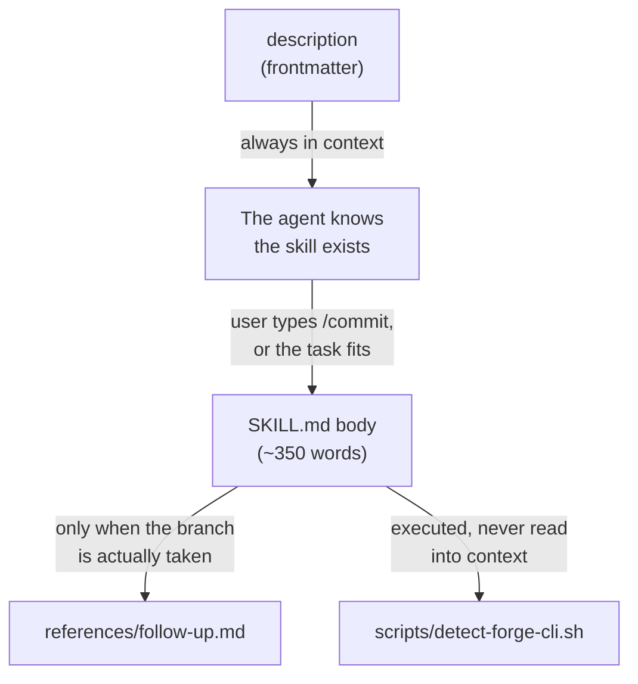
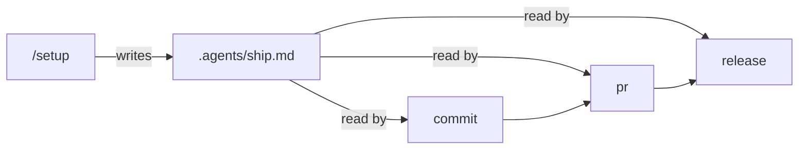

# Skrrt skills: a walkthrough guide

> A presenter's guide to the skrrt skills — what each one does, what is inside them, and the design
> decisions worth explaining.

## Contents

- [The one-sentence pitch](#the-one-sentence-pitch)
- [Installing](#installing)
- [What is inside a skill](#what-is-inside-a-skill)
- [The ship bucket](#the-ship-bucket)
- [The docs bucket](#the-docs-bucket)
- [Design decisions worth explaining](#design-decisions-worth-explaining)
- [How the skills are tested](#how-the-skills-are-tested)
- [Suggested demo order](#suggested-demo-order)
- [Things to be honest about](#things-to-be-honest-about)

## The one-sentence pitch

Ask an agent to commit and it will run `git commit -m "fix stuff"` on whatever branch you happen to
be on. These skills exist so it does the thing your team actually agreed on instead.

The framing that makes the rest of the guide click: **a skill is not the action, it is the policy
over the action.** The agent was always going to commit. The skill decides whether that commit is
split by intent, carries a conventional type and gitmoji, and lands somewhere other than `main`.

## Installing

Two plugins, because there are two unrelated jobs. Install either or both.

```bash
claude plugin marketplace add skrrt-sh/skills
claude plugin install ship@skrrt     # /ship:commit, /ship:pr, /ship:release, /ship:setup
claude plugin install docs@skrrt     # /docs:md-writer
```

The [skills.sh](https://skills.sh) CLI installs the same skills under bare names — `/commit`,
`/md-writer` — by scanning the repo for every `SKILL.md`. Worth a sentence on camera, because the
namespace prefix is the most common source of "why doesn't my slash command exist".

Then, once per repository:

```text
/ship:setup
```

## What is inside a skill

This is the part people are usually curious about. A skill is a directory, and every part of it
loads at a different time.



That staging is the whole reason a skill beats a long section of `CLAUDE.md`. The description costs
you context on every single turn, so it stays one or two sentences. The body costs you context only
when the skill is used. A reference file costs nothing until the agent hits the specific situation
it covers.

| Directory | Holds | Loaded |
| --- | --- | --- |
| `SKILL.md` | The core workflow | On invocation |
| `references/` | Conditional knowledge for one branch of the workflow | Only when that branch is taken |
| `scripts/` | Deterministic operations | Executed, never read into context |
| `assets/` | Templates that end up in the output | Copied by a script |
| `agents/openai.yaml` | Codex display name and invocation policy | By Codex |
| `evals/` | Behavior and trigger test cases | Never at runtime |

A good line for the video: **if the agent has to think about it, it goes in `SKILL.md`; if it does
not, it goes in `scripts/`.** Detecting whether a remote is GitHub or GitLab is not a judgment call,
so it is eighty lines of bash, not a paragraph of prose.

## The ship bucket

Four skills, one shared policy file.



**`setup`** asks which branching strategy the repository follows — GitHub Flow, Trunk-Based, or
Gitflow — recommends one from evidence it gathers (CI config, feature flags, contributor count,
existing branches), and lets you make the call. It writes the chosen policy to
`.agents/ship.md` and a short pointer into `CLAUDE.md` or `AGENTS.md`. Run once per repo.

**`commit`** reads the policy, refuses to commit on a protected branch (it creates a work branch
from the current `HEAD` first, without pulling or stashing, so your worktree survives intact),
groups the diff by intent, and writes a conventional-commit message with a mandatory gitmoji.

**`pr`** runs the bundled forge detector, pushes the branch, and opens or updates the review request
with `gh` or `glab` — whichever matches the remote. Under Gitflow it never rebases; under the other
two it will, but rewriting an already-published branch always stops and asks first.

**`release`** first classifies what you actually want: notes only, prepare, or publish. Publishing
runs a verification gate — clean worktree, `HEAD` at the remote release commit, non-empty release
range, tag still absent remotely — before it creates an annotated tag and the forge release.

## The docs bucket

**`md-writer`** writes knowledge-base markdown: frontmatter, Mermaid instead of ASCII art, related
document links, and a lint-clean finish. Its scope is deliberately narrow — guides, specs, ADRs,
runbooks, API docs. It stays away from README, CHANGELOG, `CLAUDE.md`, and `SKILL.md`, because
adding frontmatter to those breaks the conventions readers and tools expect.

The bundled validator is the interesting part on camera. It auto-fixes the mechanical rules in place
— whitespace, list markers, fence spacing, final newline — and reports back only what needs
judgment: line length, missing fence languages, heading structure. The agent spends tokens on the
things a script cannot decide.

Its exit codes are worth showing, because they encode a real lesson:

| Exit | Meaning |
| --- | --- |
| `0` | Clean, or deliberately skipped as a meta file |
| `1` | Bad invocation or linter failure |
| `2` | Violations remain — fix and rerun |
| `3` | No linter available |

That `3` used to be a `0`. Returning success when the linter never ran means the agent cheerfully
reports "validated" about a file nothing ever checked. **A tool that cannot run must say so.**

## Design decisions worth explaining

These are the parts that make a video interesting rather than a feature tour.

### A hidden skill just means raw git

Claude Code has a `disable-model-invocation: true` flag. It sounds like a safety feature for
anything with side effects, and the docs list `/commit` as an example use case.

But it removes the skill's description from the agent's context entirely. The agent no longer knows
the skill exists — so when you say "commit this", it does not decline. It runs `git commit` itself,
with none of the conventions. Hiding the policy does not stop the action; it just removes the
policy.

So the ship skills stay visible, and side effects are gated where they actually happen — the
permission rules in `templates/claude-settings.json` put `git commit`, `git push`, and the forge
create commands behind an approval prompt.

`setup` is the one exception, and the reason is a different one: it is a run-once configurator, a
mode you deliberately enter, not a situation the agent should recognize.

### The policy lives in a file, not in the skills

Three skills need to know which branches are protected. Putting that in each skill means three
copies drifting apart. `setup` writes it once to `.agents/ship.md`, and `commit`, `pr`, and
`release` each read it. Change strategy later and you rerun `setup`, not three skills.

### Bundled scripts run without a permission prompt

A skill can pre-approve its own script:

```yaml
allowed-tools: Bash(${CLAUDE_SKILL_DIR}/scripts/detect-forge-cli.sh:*)
```

`${CLAUDE_SKILL_DIR}` expands in both the frontmatter rule and the skill body, so the rule matches
the exact command the body tells the agent to run. The grant covers only that script and clears
when you send your next message.

### Descriptions are the routing mechanism

For a model-invocable skill, the description is the whole reason it gets picked. The pattern that
works is one sentence of what it does, one sentence of when to use it:

```yaml
description: Create focused conventional commits with a mandatory gitmoji. Use when the user asks
  to commit, write a commit message, or split changes into commits.
```

Not three paragraphs of trigger phrases. Not a bare label with no "use when" at all.

## How the skills are tested

Two layers, and the distinction is worth drawing on camera.

**Deterministic tests** run in CI on every push and check structure: frontmatter stays inside the
Agent Skills spec, every linked file exists, bundled scripts are executable, skills stay under
budget, manifests agree with what is on disk.

```bash
npm ci --prefix skills/docs/md-writer
./scripts/test-skills.sh
```

**Behavior evals** check whether the skills actually work. Each skill carries scenario cases in
`evals/evals.json`, and every model-invocable one also carries twenty trigger queries where half
are requests it should decline — usually a neighbouring skill's territory, since `commit` wrongly
grabbing "open a pull request" is the failure that actually bites.

The honest bit for the video: **eval manifests are specifications, not results.** They only mean
something once you run them, in a fresh context, against a baseline.

## Suggested demo order

1. Show a repo with no configuration. Ask the agent to commit something. Watch it hand-write
   `git commit`.
2. Run `/ship:setup`. Walk through the strategy recommendation and pick one. Open the generated
   `.agents/ship.md`.
3. Make two unrelated changes at once, on `main`. Ask to commit. Two things to point at: it moves
   off `main` first, and it produces two commits instead of one.
4. Run `/ship:pr`. Show the forge detector output before the push.
5. Ask for a guide in `docs/`. Show `md-writer` triggering without a slash command.
6. Delete the validator's `node_modules` and rerun it to show exit `3` — the tool refusing to claim
   success.

Step 6 is the best thirty seconds in the demo, because it is the least expected.

## Things to be honest about

Worth saying out loud so nobody hits them mid-demo:

- `commit`, `pr`, and `release` stop if `.agents/ship.md` is missing. `setup` is not optional.
- `pr` and `release` need `gh` or `glab` installed **and authenticated** for the remote host. The
  detector checks auth, not just presence.
- The `md-writer` validator needs Node 22 or newer.
- Upgrading ship from 4.x is a forced migration: existing repos must rerun `/setup` before the
  other three skills will run.
