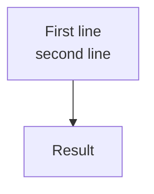

# Markdown Authoring

Write readable, lint-clean knowledge-base documents. Match an established local convention before
applying this skill's defaults.

## Document shape

Use this frontmatter for new documents, omitting fields whose values are unknown:

```yaml
---
title: "Document title"
description: "One-sentence purpose"
created: "YYYY-MM-DD"
updated: "YYYY-MM-DD"
status: "draft"
---
```

Add `author`, `version`, `tags`, `category`, `aliases`, `related`, `refs`, or `audience` only when
the user, repository, or document supplies a real value. Never invent metadata. For new documents,
use today's date and `version: "1.0.0"` only when the repository versions individual documents.

Make the H1 match `title`. Follow it with a one-line blockquote summary. Add a table of contents
when it materially improves navigation, typically at five or more H2 sections.

## Diagrams

Use Mermaid instead of ASCII art. Choose the diagram type that fits the relationship. Use `<br/>`
for line breaks in labels; a literal `\n` does not render as a break.



## Formatting

- Wrap prose at 120 characters; exempt code blocks and tables.
- Avoid inline HTML outside Mermaid content.
- Use compact tables with single-space cell padding.
- Name files with lowercase hyphenated words.
- Give every fenced code block a language.

## Related documents

For a document in an existing knowledge base, search nearby Markdown files and titles for genuine
topic, dependency, or parent/child overlap. Add deduplicated relative paths to this document's
`related` field. Edit existing documents to add backlinks only when the user asked for
bidirectional links; update only their `related` and `updated` fields.

## Validate

From the target repository, run
`${CLAUDE_SKILL_DIR}/scripts/validate-md.sh <file.md>` on every changed in-scope Markdown
file. It may rewrite mechanical formatting; re-read a changed file before editing it again. Fix
reported judgment-based violations and repeat until clean.

Read [references/validation.md](references/validation.md) only when validation is skipped, cannot
start, or reports a violation.
