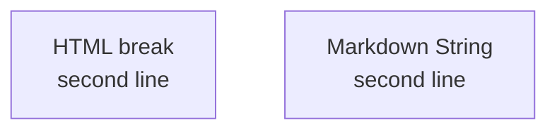

# MD Writer Skill

Write knowledge-base markdown — guides, specs, ADRs, runbooks, API docs — with consistent
metadata and lint-clean formatting.

## Scope

Frontmatter, cross-referencing, and linting apply to knowledge-base documents only. Skip all
three for files with established conventions: `README`, `CHANGELOG`, `CONTRIBUTING`,
`CODE_OF_CONDUCT`, `SECURITY`, `LICENSE`, `GOVERNANCE`, `SUPPORT`, `CLAUDE.md`, `AGENTS.md`,
`SKILL.md`, and issue/PR templates — including their `.github/` copies. Adding frontmatter to
those breaks the conventions readers and tools expect.

## Frontmatter

```yaml
---
title: "Document Title"
description: "Brief description of the document purpose"
author: "Author name or team"
created: "YYYY-MM-DD"
updated: "YYYY-MM-DD"
version: "1.0.0"
status: "draft | review | published"
---
```

New documents start at `version: "1.0.0"`, `status: "draft"`, with today's date in both date
fields. Add these when relevant: `tags`, `category` (architecture, guide, api, runbook, adr,
spec), `aliases` for names people might search for, `related` (relative paths), `refs`
(external URLs that informed the doc), `audience`.

The H1 must match the frontmatter `title`, and a one-line `>` summary follows it. Add a table
of contents once the document has 3+ sections.

## Diagrams

Every diagram is Mermaid in a ```mermaid fence — never ASCII art. Any valid diagram type is
fair game (`flowchart`, `sequenceDiagram`, `stateDiagram-v2`, `erDiagram`, `gantt`, `mindmap`,
`architecture-beta`, …). For line breaks use `<br/>` — it works in flowchart labels, sequence
messages, notes, and actor aliases. A real newline breaks a line only inside a Mermaid Markdown
String (a backtick-quoted label in a flowchart or mindmap). Never write a literal `\n` and
expect it to render.

Both working forms:



## Formatting

- **120 character lines max**, prose only — code blocks and tables are exempt.
- **No inline HTML.**
- Tables use single-space padding and minimal dashes — never pad columns to equal width.
- Filenames are lowercase with hyphens: `integration-guide.md`.

Validate as the final step after writing or editing any file:

```bash
bash "${CLAUDE_SKILL_DIR}/scripts/validate-md.sh" <path/to/file.md>
```

Exit `2` prints violations — fix and re-run until it passes. Exit `0` means clean **or skipped**,
so treat it as "nothing to fix" rather than proof the file was linted: the script skips anything
under `.claude/` and the unambiguous meta files (`README`, `CLAUDE`, `AGENTS`, `CONTRIBUTING`,
`CHANGELOG`, `CODE_OF_CONDUCT`, `SECURITY`, license files), and also exits `0` when neither a
local `markdownlint-cli2` nor `npx` is available. Its skip list is deliberately narrower than
the frontmatter scope above — `GOVERNANCE`, `SUPPORT`, `SKILL.md`, and issue/PR templates skip
frontmatter but still get linted.

The script finds a project `.markdownlint.json` (or `.jsonc`/`.yaml`/`.yml`) by walking up from
the file and otherwise uses `config/markdownlint-default.json`. Run `npm install` once in this
skill directory for the local binary; otherwise it falls back to `npx`.

## Cross-Referencing

Only for documents with frontmatter, and only before writing the body — once the title, tags,
and category are settled:

1. **Search** — one Grep over `**/*.md` for 2-3 key terms, plus the file's own directory.
2. **Read only the matches' frontmatter** and confirm real overlap — shared topic, dependency,
   or parent/child. Most files will not qualify.
3. **Link both ways** — append relative paths to `related` in this file and each match, and
   bump their `updated`. Touch nothing else in those files.

Never duplicate or remove existing `related` entries. Add the field if missing. Out-of-scope
files are never cross-reference targets.

## Task

Write the markdown document for: $ARGUMENTS
